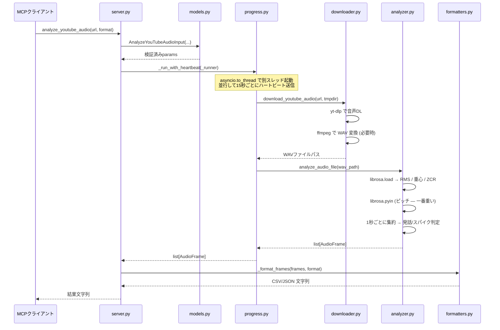

# audio-analyzer-mcp

YouTube動画やローカルファイルの音声を分析し、1秒ごとの声量(dB)・ピッチ(Hz)・発話検出をCSV/JSONで返すMCPサーバー。

ゲーム実況のショート動画素材選定など、「どこで声が跳ねたか」を数値で特定する用途に最適。

## ツール一覧

| ツール名 | 説明 |
|---------|------|
| `analyze_youtube_audio` | YouTube URLから音声をDL→1秒ごとの分析データ（CSV/JSON） |
| `analyze_local_audio` | ローカルファイル（mp4, wav等）を分析 |
| `detect_highlights` | YouTube URLから音声のハイライト（声量スパイク、興奮ポイント）を自動検出 |
| `detect_highlights_local` | ローカルファイルから同じロジックでハイライト抽出（YouTube bot検出の回避策） |

## 出力データの列

| 列名 | 説明 |
|------|------|
| `timestamp` | MM:SS形式のタイムスタンプ |
| `time_sec` | 秒数（字幕データとの突き合わせ用） |
| `rms_db` | 声量（dB）。-60以下≒無音、-20以上≒叫び |
| `rms_norm` | 声量を0-100に正規化 |
| `pitch_hz` | 声の高さ（Hz）。男性通常100-150Hz、興奮時200Hz超 |
| `spectral_centroid` | 声の鋭さ（Hz）。ツッコミ等で上昇 |
| `is_speech` | 発話中か（true/false） |
| `volume_spike` | 直前3秒と比べて急激に声量上昇（true/false） |

## セットアップ

### 前提条件

- Python 3.10以上
- ffmpeg（`brew install ffmpeg` or `apt install ffmpeg`）
- uv（推奨）または pip

### インストール

```bash
cd audio-analyzer-mcp
uv sync
```

### Claude Desktop設定

`claude_desktop_config.json` に以下を追加：

```json
{
  "mcpServers": {
    "audio-analyzer": {
      "command": "uv",
      "args": [
        "--directory", "/path/to/audio-analyzer-mcp",
        "run", "python", "-m", "audio_analyzer_mcp"
      ]
    }
  }
}
```

## 使い方の例

### ショート動画素材の選定フロー

1. `detect_highlights` でハイライト候補を自動検出
2. `youtube-transcript` MCPで字幕を取得
3. `time_sec` で突き合わせ → 「何を言った瞬間に声が跳ねたか」が分かる

### Claude への指示例

```
このYouTube動画のハイライトを検出して、字幕と突き合わせてショート候補を出して。
URL: https://www.youtube.com/watch?v=XXXXX
```

### ローカル録画からのハイライト抽出

YouTubeのbot検出（PO Token要求など）で `detect_highlights` が失敗する場合、OBSなどで取ったローカル録画を直接解析できる:

```
次のローカル動画のハイライト上位30件を60秒間隔で出して。
path: /Users/tsmzk/Videos/2026-xx-xx_stream.mp4
```

`detect_highlights_local` は `file_path` / `top_n` / `min_gap_sec` の3つが必須引数（デフォルトなし）。動画の長さに合わせて都度指定する。

### ハイライト出力の列

`detect_highlights` / `detect_highlights_local` の `highlights[]` に含まれるキー:

| キー | 説明 |
|------|------|
| `rank` | 1始まりの順位（スコア降順） |
| `time_sec` | 秒（int。字幕突き合わせ用） |
| `time_hms` | `H:MM:SS` または `M:SS`。1時間超の配信でも読みやすい |
| `timestamp` | `MM:SS`（既存フィールド。短尺向け） |
| `score` | 複合スコア |
| `reasons` | 加点理由のリスト（`volume_spike` / `very_loud` / `loud` / `high_pitch` / `sharp_voice`） |
| `rms_db` / `rms_norm` / `pitch_hz` / `spectral_centroid` | そのフレームの生の特徴量 |

## 処理の流れ

### モジュール構成

`audio_analyzer_mcp/` パッケージは責務ごとに 8 ファイルに分かれています。依存は上から下に流れ、共通の土台は `constants.py`。

```
                ┌─────────────────────────────────────────────┐
                │  server.py                                  │
                │  ・MCPサーバー本体 (FastMCP)                  │
                │  ・3つのツール定義 (@mcp.tool)                │
                │  ・main() エントリーポイント                  │
                └──┬───────┬────────┬─────────┬───────────────┘
                   │       │        │         │
        ┌──────────┘       │        │         └──────────────┐
        ▼                  ▼        ▼                        ▼
  ┌──────────┐      ┌────────────┐ ┌──────────────┐   ┌────────────┐
  │ models   │      │ formatters │ │ highlights   │   │ progress   │
  │  入力検証  │      │ CSV/JSON   │ │ スコアリング   │   │ asyncio    │
  │ (Pydantic)│      │ + エラー    │ │ + 間引き      │   │ ↔ thread   │
  └─────┬────┘      └─────┬──────┘ └──────┬───────┘   └────────────┘
        │                 │               │
        └─────────────────┼───────────────┘
                          ▼
                   ┌──────────────┐         ┌──────────────┐
                   │ analyzer.py  │ ◄────── │ downloader.py│
                   │ librosa解析   │         │ yt-dlp+ffmpeg│
                   └──────┬───────┘         └──────┬───────┘
                          │                        │
                          └─────────┬──────────────┘
                                    ▼
                            ┌──────────────┐
                            │ constants.py │
                            │ 定数・例外     │
                            │ AudioFrame   │
                            └──────────────┘
```

### シーケンス図 (analyze_youtube_audio)

YouTube動画の解析がリクエストされたときの全体の流れ:



`analyze_local_audio` はダウンロード工程をスキップし、ファイルパスを直接 `analyze_audio_file` に渡すだけ。
`detect_highlights` は同じ解析結果を `_detect_highlight_moments` でスコアリングしてから返す。
`detect_highlights_local` は `detect_highlights` の最初のDL工程だけを `analyze_local` に差し替えた形で、スコアリング以降のロジック（`build_highlight_summary`）を共有する。

### ステップ詳細

#### 1. 入力検証 (models.py)

各ツールの引数は Pydantic モデルで受け取り、サーバー本体に届く前に検証される:

- `youtube_url`: 10〜500文字、`https://(www.)?youtube.com/...` または `https://youtu.be/...`
- `format`: `csv` / `json` (大文字小文字を吸収)
- `sample_rate` / `hop_length` / `frame_length`: 範囲チェック
- `frame_length >= hop_length` のクロス検証 (librosa の不可解なエラーを未然に防ぐ)

不正な入力は MCP クライアントへ「入力エラー」として即座に返り、解析は走らない。

#### 2. 進捗ブリッジ (progress.py)

このプロジェクトで一番複雑な部分。次の3つの問題を同時に解く:

| 問題 | 対処 |
|------|------|
| librosa は同期処理で数十秒〜数分かかる。直接呼ぶと asyncio イベントループが止まる | `asyncio.to_thread` で別スレッドに逃がす |
| 別スレッドからは `await ctx.report_progress(...)` を直接呼べない | `asyncio.run_coroutine_threadsafe` でメインループにコルーチンを投げ込む |
| Claude Desktop は約4分の通信無音でタイムアウトする | 15秒ごとに「まだ動いてます」のハートビートを `asyncio.create_task` で並行送信 |

```
    async server.py            asyncio.to_thread             librosa thread
        │                            │                            │
        ├──── _run_with_heartbeat ──►│                            │
        │     (heartbeat タスク開始)  │                            │
        │                            ├────── runner(_cb) ────────►│
        │  ◄───── 15s ハートビート ─── │                            │
        │  (await ctx.report_progress)│                            │
        │                            │  ◄── _cb("...", 0.4) ──── │
        │  ◄── run_coroutine_threadsafe(ctx.report_progress) ─── │
        │                            │  ◄── _cb("...", 0.8) ──── │
        │  ◄── run_coroutine_threadsafe(ctx.report_progress) ─── │
        │                            │  ◄────── return frames ── │
        │  ◄────── frames ────────── │                            │
        │  (heartbeat キャンセル)      │                            │
```

#### 3. ダウンロード (downloader.py)

1. `shutil.which` で `yt-dlp` / `ffmpeg` の存在を確認 (なければ親切なエラー)
2. URL の prefix チェック
3. `yt-dlp --print "%(duration)s" --skip-download` で動画長を先取り (進捗表示用、失敗してもスキップ)
4. `yt-dlp -x --audio-format wav` で音声のみ抽出 (タイムアウト10分)
5. 出力が WAV でなければ `ffmpeg` でモノラル+指定サンプリングレートに再変換
6. ダウンロード先は `tempfile.TemporaryDirectory` — `with` ブロックを抜けた瞬間に自動削除

#### 4. 音声解析 (analyzer.py)

librosa を使って WAV → 1秒ごとの特徴量に落とす:

```
librosa.load(file, sr=8000, mono=True)
     │  → 波形 ndarray y, サンプリングレート sr
     ▼
高速な特徴量 (全体の数秒〜十数秒)
  ├── librosa.feature.rms              → 音量 (生値)
  ├── librosa.amplitude_to_db          → 音量 (dB)
  ├── librosa.feature.spectral_centroid → 声の鋭さ
  └── librosa.feature.zero_crossing_rate → 発話判定の補助
     │
     ▼
ピッチ推定 (ここが一番重い、数十秒〜数分)
  librosa.pyin(fmin=C2, fmax=C7)      → 基本周波数 f0 (NaN含む)
     │
     ▼
1秒ごとに集約
  for sec in range(total_seconds):
    ├── numpyブールマスクで該当区間を抽出
    ├── 各特徴量を平均 (np.nanmean で NaN 無視)
    ├── 発話判定:  rms_db > -50 AND 0.01 < zcr < 0.30 AND 300 < centroid < 5000
    └── スパイク判定: 直近3秒の平均と比べて +10dB 以上跳ねた
     │
     ▼
list[AudioFrame] (1秒1要素)
```

音量正規化 (`rms_norm`) は、解析対象全体の dB 値の上下1パーセンタイルを基準に 0〜100 にスケーリングする。外れ値の影響を受けにくく、動画ごとに「相対的にどれくらい大きい音か」が分かる。

#### 5. ハイライト検出 (highlights.py)

`detect_highlights` ツールから呼ばれる。各発話フレームに以下の加点を行い、合計スコアでランク付けする:

| 条件 | 加点 | 理由 |
|------|------|------|
| 音量スパイク (`volume_spike == True`) | +50 | 急な盛り上がりは最強のシグナル |
| 上位5%の音量 | +30 | 全体の中で特に大きい声 |
| 上位10%の音量 (上位5%未満) | +15 | やや大きい声 |
| 上位10%のピッチ | +20 | 興奮・驚きの指標 |
| 上位10%のスペクトル重心 | +10 | 鋭い声 (ツッコミ・叫び) |

スコア計算後の処理:

1. スコア降順でソート
2. `min_gap_sec` (既定10秒) 以内に既選択がある候補は捨てる (近接スパイクのクラスタ化を防ぐ)
3. 上位 `top_n` (既定20件) を返す

#### 6. 出力整形 (formatters.py)

| 関数 | 用途 |
|------|------|
| `_frames_to_csv` | `csv.DictWriter` で1秒1行のCSVに |
| `_frames_to_json` | `json.dumps(..., ensure_ascii=False)` で日本語そのまま出力 |
| `_format_error` | 例外の種類別 (`DownloadError` / `AnalysisError` / `ValueError` / その他) に「対処法付きエラーメッセージ」へ整形 |

例外は MCP クライアントには「人間が読んで対処できる文章」として返り、詳細スタックトレースは stderr のログにだけ流す。

## 技術詳細

- **音声DL**: yt-dlp（音声のみ抽出、WAV変換）
- **分析**: librosa
  - RMS: `librosa.feature.rms` → `amplitude_to_db`
  - ピッチ: `librosa.pyin`（人声特化のF0推定アルゴリズム）
  - スペクトル重心: `librosa.feature.spectral_centroid`
- **ハイライト検出**: 声量スパイク + 上位パーセンタイル + ピッチ上昇の複合スコアリング

## 注意事項

- 1時間の動画の分析には数分かかります（主にピッチ推定が重い）
- yt-dlpとffmpegがPATHに必要です（ローカルファイル解析は yt-dlp なしでも動くが、動画からの音声抽出にはffmpegが必要）
- YouTube動画は公開動画のみ対応
- YouTubeのbot検出でDLが通らない場合は `detect_highlights_local` にローカル録画を渡す運用を推奨

## テスト

```bash
uv run python -m unittest discover tests
```

pure-Pythonのユニットテストのみ（librosa/ffmpeg不要）。ハイライト出力の形状・順位付け・`min_gap_sec` 間引き・入力バリデーションを検証する。
